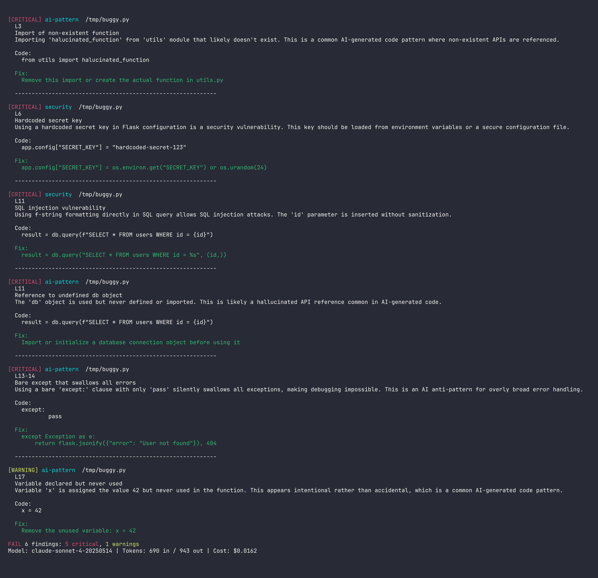

# probe

Zero-config CLI that reviews code using Claude and catches issues linters miss, especially AI-generated code anti-patterns.



## The Problem

AI writes code fast but misses edge cases. Linters catch syntax errors but not logic bugs, security holes, or patterns that are uniquely AI-generated: hallucinated function calls, overly broad try/catch, copy-paste inconsistencies, undefined variables that look intentional.

CodeRabbit and Diffray exist but require accounts, YAML config, and platform integration. Probe is zero-config: point it at code, get a review. One binary, BYO API key.

## Install

```bash
go install github.com/jtsilverman/probe@latest
```

Or clone and build:
```bash
git clone https://github.com/jtsilverman/probe.git
cd probe && go build -o probe .
```

## Usage

```bash
export ANTHROPIC_API_KEY=sk-ant-...

# Review staged changes (most common flow)
probe

# Review your branch vs main
probe --branch main

# Review a specific file
probe --file src/api.py

# Pipe anything in
cat sketch.py | probe --stdin

# JSON output for CI
probe --branch main --json

# HTML report
probe --branch main --html > report.html

# Generate fix patches
probe --fix | git apply

# Only show critical/warning (skip info)
probe --severity warning

# Only show security issues
probe --category security

# Use Claude Code subscription ($0 cost)
probe --cli

# Double-check findings (reduces false positives, 2x cost)
probe --verify
```

## GitHub Action

```yaml
- name: AI Code Review
  uses: jtsilverman/probe@main
  with:
    anthropic-api-key: ${{ secrets.ANTHROPIC_API_KEY }}
    severity: warning
    fail-on: critical
```

Or without the action:
```yaml
- name: AI Code Review
  run: |
    go install github.com/jtsilverman/probe@latest
    probe --branch main --severity warning
  env:
    ANTHROPIC_API_KEY: ${{ secrets.ANTHROPIC_API_KEY }}
```

Exit code 1 on critical findings, so `probe || exit 1` works as a CI gate.

## Configuration (.proberc)

Create a `.proberc` file in your project root:

```yaml
ignore:
  - "vendor/**"
  - "*.generated.go"
  - "**/*_test.go"

severity: warning
categories:
  - bug
  - security
  - ai-pattern

model: claude-sonnet-4-20250514

rules:
  - name: no-fmt-println
    description: Use structured logging instead of fmt.Println
    pattern: fmt.Println
    severity: warning
    category: style
```

CLI flags override `.proberc` settings.

## What It Catches

| Category | Examples |
|----------|----------|
| **security** | SQL injection, hardcoded secrets, XSS, insecure deserialization |
| **bug** | Undefined variables, off-by-one errors, null dereferences, race conditions |
| **ai-pattern** | Hallucinated imports, bare except clauses, unused variables, inconsistent error handling |
| **performance** | N+1 queries, unnecessary loops, blocking I/O in async contexts |
| **style** | Inconsistent naming, dead code, overly complex conditionals |

### Language-Specific Checks

Probe detects the primary language and adds tailored checks:

- **Go**: Unchecked errors, goroutine leaks, defer misuse, mutex issues
- **Python**: Mutable default arguments, bare except, f-string injection
- **JavaScript/TypeScript**: Prototype pollution, unhandled promises, XSS
- **Rust**: unwrap() in production, unsafe blocks, clone on large types

## Features

- **Zero-config**: Point at code, get a review. One binary, no setup.
- **.proberc**: Optional config for ignore patterns, severity defaults, custom rules
- **--fix**: Generates unified diff patches from Claude's suggestions. Apply with `git apply`.
- **Full-file context**: Passes surrounding code to Claude for better accuracy (not just the diff)
- **Review caching**: Skip re-reviewing identical diffs (24h TTL, keyed by content + model)
- **Language-specific prompts**: Tailored checks for Go, Python, JS/TS, Rust
- **Verify mode**: Double-pass review, keeps only confirmed findings
- **5 output formats**: Terminal (colored), JSON, Markdown, HTML, Patch

## Output Formats

```bash
probe                    # Colored terminal (default)
probe --json             # JSON (for CI/tooling)
probe --markdown         # GitHub-compatible markdown
probe --html             # Self-contained HTML report
probe --fix              # Unified diff patches
```

## Cost

Each review costs ~$0.01-0.05 depending on diff size (Claude Sonnet pricing: $3/$15 per MTok input/output). Token usage and cost are shown in every review output.

Use `--cli` to use your Claude Code subscription instead ($0 per review).

## The Hard Part

Getting Claude to produce consistent, parseable JSON reviews with accurate line numbers. The prompt engineering required:
1. Strict JSON schema in the system prompt with explicit field definitions
2. Line numbers embedded directly in the diff content (L1, L2, etc.) so Claude can reference them
3. Validation layer that discards findings with invalid line references
4. Fallback JSON parsing (handles markdown code blocks, bare arrays, nested objects)

For v0.2.0, generating valid unified diff patches from Claude's suggested fixes was the hard problem. The code snippet in the finding might not exactly match the file (whitespace differences, truncation). The patch generator validates that the suggestion matches the actual file content before generating a patch, and skips findings where it doesn't match.

## Tech Stack

- **Go** for single-binary distribution and fast CI cold starts
- **Anthropic SDK** (official Go SDK) for Claude API
- **cobra** for CLI framework
- No external dependencies beyond the Claude API

## License

MIT
